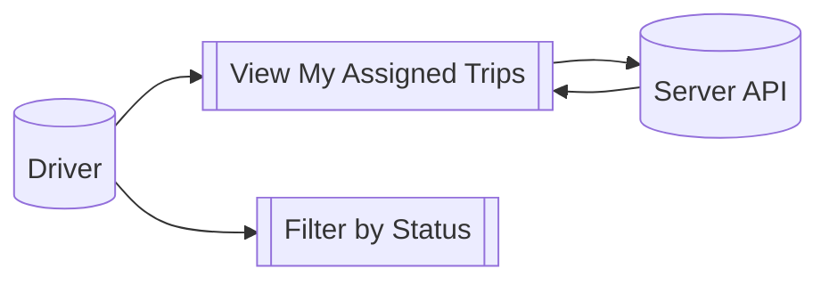
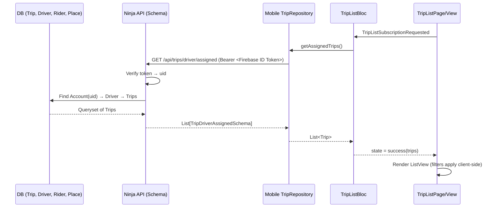
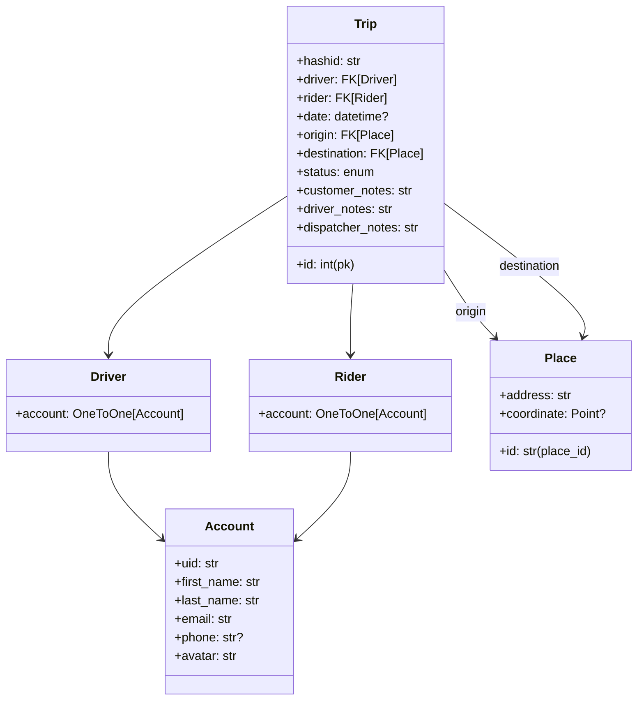
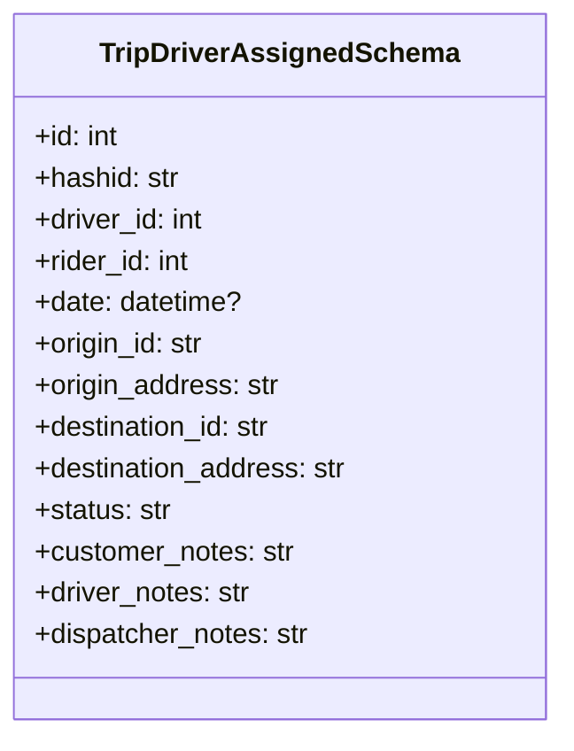
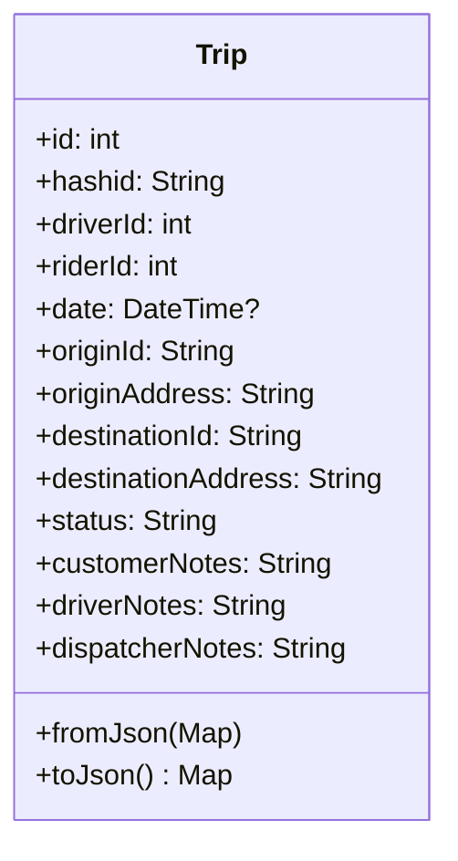
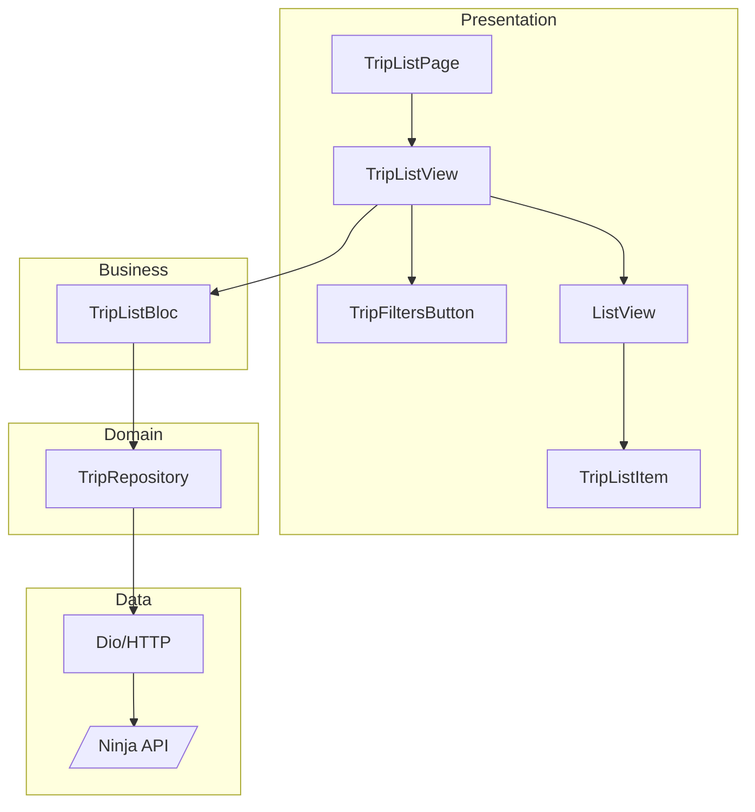
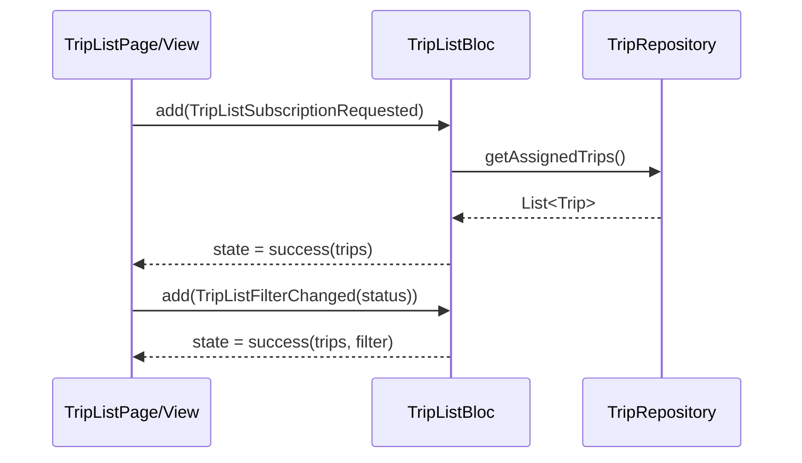

# Trip List

The Trip List feature lets an authenticated Driver view all trips assigned to them. It presents a filterable list (by status) and fetches data from the server using the current Firebase user’s ID token.

- Purpose: give drivers a quick overview of their assigned trips (origin → destination, date/time, status). A full design rationale and UX details live in the Design section.



---

## Overview

High-level flow: DB → Schema → Data → Domain → Presentation.



---

## Main Entities

### DB models

Trips are stored in Postgres via Django ORM. Key entities: `Trip`, `Place`, `Driver`, `Rider`.

Full source:
- Trip/Place: https://github.com/ohjime/wagon/blob/main/src/server/lib/trip/models.py
- Driver/Rider/Account: https://github.com/ohjime/wagon/blob/main/src/server/lib/core/models.py



### DB schema

The API exposes a curated schema to mobile: `TripDriverAssignedSchema`. It includes essential Trip fields plus denormalized origin/destination address strings for easy rendering.

Full source: https://github.com/ohjime/wagon/blob/main/src/server/lib/trip/api.py



Endpoint:
- `GET /api/trips/driver/assigned`
- Auth: `Authorization: Bearer <Firebase ID Token>`
- Router registration: https://github.com/ohjime/wagon/blob/main/src/server/lib/app/api.py

### Frontend models

The mobile frontend defines `Trip` matching the response schema and provides `fromJson`/`toJson` helpers.

Full source: https://github.com/ohjime/wagon/blob/main/src/mobile/lib/core/models/trip.dart



Key mapping notes:
- `date` is ISO8601 in JSON; parsed to `DateTime?` in Dart.
- `origin_address`/`destination_address` provided for direct rendering.

---

## Domain layer

The `TripRepository` is the mobile domain abstraction around remote data. It fetches the current Firebase user, gets an ID token, and calls the server endpoint.

Full source: https://github.com/ohjime/wagon/blob/main/src/mobile/lib/core/repositories/trip_repository.dart

```dart title="TripRepository.getAssignedTrips()"
final resp = await _dio.get(
  '$_apiBaseUrl$_assignedTripsEndpoint',
  options: Options(headers: {'Authorization': 'Bearer $idToken'}),
);
if (resp.statusCode == 200 && resp.data is List) {
  return (resp.data as List)
      .whereType<Map<String, dynamic>>()
      .map((json) => Trip.fromJson(json))
      .toList();
}
```

Dependency injection is done at app start so the repository is available to feature blocs:

Full source: https://github.com/ohjime/wagon/blob/main/src/mobile/lib/main.dart

```dart title="main.dart excerpt"
return MultiRepositoryProvider(
  providers: [
    RepositoryProvider.value(value: _authenticationRepository),
    RepositoryProvider<TripRepository>(create: (_) => TripRepository()),
  ],
  child: AppView(onGenerateRoute: _onGenerateRoute),
);
```

Server-side fetch logic (authorization, lookup, and query):

Full source: https://github.com/ohjime/wagon/blob/main/src/server/lib/trip/api.py

```python title="/api/trips/driver/assigned (simplified)"
decoded = auth.verify_id_token(token)
uid = decoded.get("uid")
account = Account.objects.get(uid=uid)
driver = Driver.objects.get(account=account)
trips = Trip.objects.select_related("origin", "destination").filter(driver=driver)
return [TripDriverAssignedSchema(... from t ... ) for t in trips]
```

---

## Presentation layer

The Trip List feature uses Bloc for state management:

- Bloc: https://github.com/ohjime/wagon/blob/main/src/mobile/lib/trip/list/bloc/trip_list_bloc.dart
- Events: https://github.com/ohjime/wagon/blob/main/src/mobile/lib/trip/list/bloc/trip_list_event.dart
- State: https://github.com/ohjime/wagon/blob/main/src/mobile/lib/trip/list/bloc/trip_list_state.dart
- Page/View: https://github.com/ohjime/wagon/blob/main/src/mobile/lib/trip/list/view/trip_list_page.dart
- Widgets: 
  - Item: https://github.com/ohjime/wagon/blob/main/src/mobile/lib/trip/list/widgets/trip_list_item.dart
  - Filters: https://github.com/ohjime/wagon/blob/main/src/mobile/lib/trip/list/widgets/trip_filters.dart

Component structure:



Bloc responsibilities:
- `TripListSubscriptionRequested`: load assigned trips; emit `loading → success/failure`.
- `TripListFilterChanged`: update in-memory status filter.
- `TripListRefreshed`: re-fetch list, preserving filter selection.

```dart title="TripListBloc handlers (excerpt)"
on<TripListSubscriptionRequested>(_onSubscriptionRequested);
on<TripListFilterChanged>(_onFilterChanged);
on<TripListRefreshed>(_onRefreshed);

Future<void> _onSubscriptionRequested(... emit) async {
  emit(state.copyWith(status: TripListStatus.loading));
  try {
    final trips = await _tripRepository.getAssignedTrips();
    emit(state.copyWith(status: TripListStatus.success, trips: trips));
  } catch (_) {
    emit(state.copyWith(status: TripListStatus.failure));
  }
}
```

UI rendering follows the state:

```dart title="TripListView builder (simplified)"
switch (state.status) {
  case TripListStatus.loading:
    return const Center(child: CupertinoActivityIndicator());
  case TripListStatus.failure:
    return const Center(child: Text('Failed to load trips'));
  case TripListStatus.success:
    final trips = state.filteredTrips.toList();
    return ListView.builder(
      itemCount: trips.length,
      itemBuilder: (_, i) => TripListItem(trip: trips[i]),
    );
  default:
    return const SizedBox.shrink();
}
```

Filters are purely client-side and map directly to backend statuses:

```dart title="TripViewFilter mapping"
switch (filter) {
  case TripViewFilter.enRoute: return trip.status == 'en_route';
  case TripViewFilter.inProgress: return trip.status == 'in_progress';
  // ...others are 1:1 with backend strings
}
```

Sequence between domain and presentation:



---

## Quick links

- Backend models: https://github.com/ohjime/wagon/blob/main/src/server/lib/trip/models.py
- Backend schema + route: https://github.com/ohjime/wagon/blob/main/src/server/lib/trip/api.py
- API wiring: https://github.com/ohjime/wagon/blob/main/src/server/lib/app/api.py
- Mobile Trip model: https://github.com/ohjime/wagon/blob/main/src/mobile/lib/core/models/trip.dart
- Mobile Trip repository: https://github.com/ohjime/wagon/blob/main/src/mobile/lib/core/repositories/trip_repository.dart
- Trip list bloc: https://github.com/ohjime/wagon/blob/main/src/mobile/lib/trip/list/bloc/trip_list_bloc.dart
- Trip list view: https://github.com/ohjime/wagon/blob/main/src/mobile/lib/trip/list/view/trip_list_page.dart
- Trip list widgets: https://github.com/ohjime/wagon/blob/main/src/mobile/lib/trip/list/widgets

